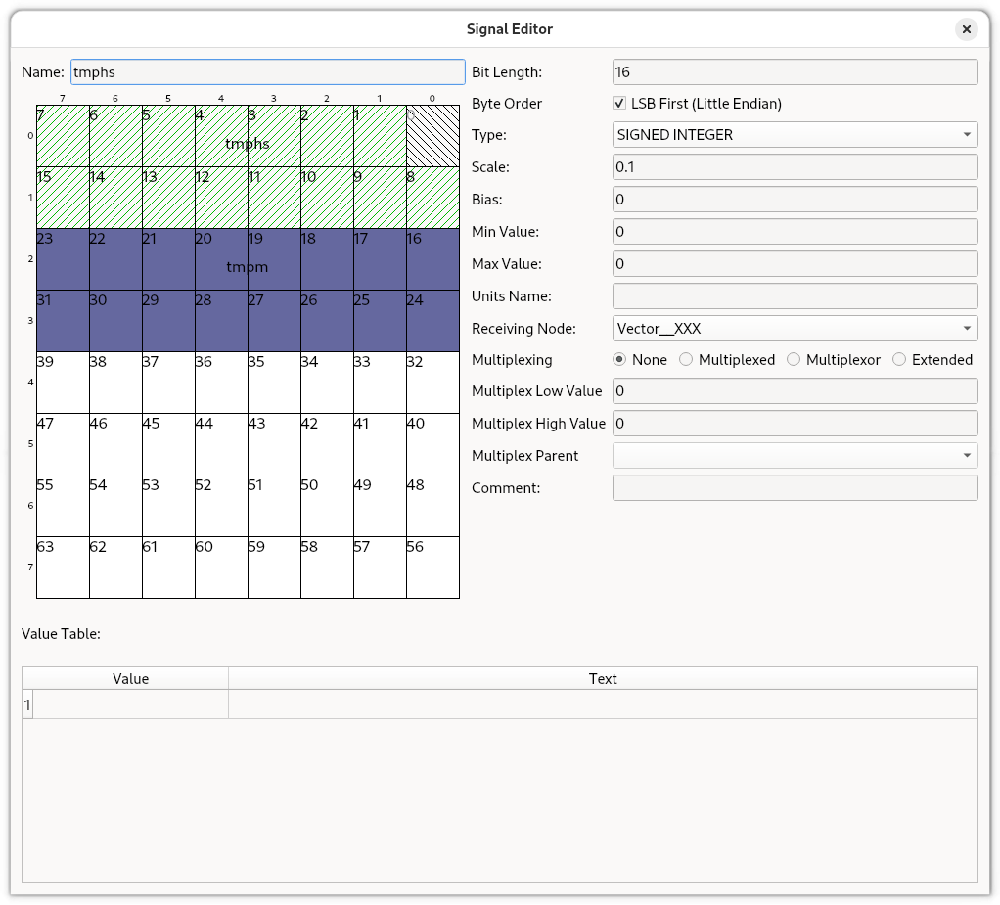
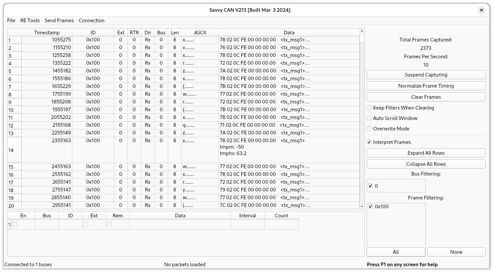

# Example CAN Message Mapping

Say you wanted to map the heatsink and motor temperatures from an openinverter board to an outgoing CAN message (for a custom instrument display to read for example). You might use a 16-bit length field for each temperature with a scale factor of 10 so you can get sub-degree precision. To put the two parameters in a single CAN message with hex ID 0x100 you would do:

```text
    $ oic can add tx 0x100 tmphs 0 16 10
    Adding CAN tx mapping with can_id=0x100 param='tmphs' position=0 length=16 gain=10.0 offset=0
    CAN mapping added successfully.
    $ oic can add tx 0x100 tmpm 16 16 10
    Adding CAN tx mapping with can_id=0x100 param='tmpm' position=16 length=16 gain=10.0 offset=0
    CAN mapping added successfully.
```

This will then immediately start sending a CAN message with ID 0x100 (decimal 256) with the two temperatures occupying the first 32-bits of the message every 100ms (or 10ms depending on the canperiod setting). You can list what the device is doing with:

```text
    $ oic can list
    0x100:
     tx.0.0 param='tmphs' pos=0 length=16 gain=10.0 offset=0
     tx.0.1 param='tmpm' pos=16 length=16 gain=10.0 offset=0
```

Don't forget to save the CAN mapping to Flash on the inverter:

```text
$ oic cmd save
Command sent successfully
```

To look at the messages in SavvyCAN you need to export the CAN map:

```text
$ oic can export --format dbc inverter-temperatures.dbc
Parameter CAN message map exported
```

If you load inverter-temperatures.dbc into SavvyCAN it will look like this in the Signal Editor:


Which would look something like this when running and interpreting the CAN messages:


Ignore the crazy temperatures, I just have a resistor rather than a temperature sensor.
