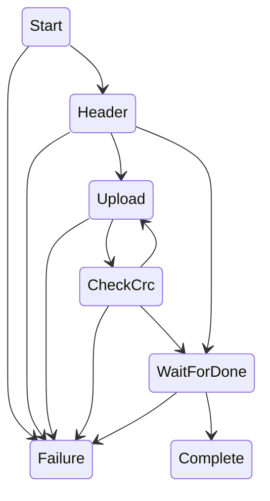

# CAN Upgrade Protocol

## Overview

This document describes the CAN protocol used by the openinverter CAN tool to upgrade the firmware on openinverter devices.

## Addressing

| CAN ID | Purpose | Description |
| ------ | ------- | ----------- |
| 0x7DE  | Device  | Devices send CAN frames to this CAN ID to initiate communication with an upgrade tool. Many devices are expected to be present on the network. |
| 0x7DD  | Upgrade Tool | The upgrade tool will respond to devices on this CAN ID. Only a single upgrade tool may communicate with devices on a given network. |

## Frame Formats

### Device Frames

#### HELLO

Sent by the device on each startup. MAY be sent by any device at any time. The device should wait 100ms for a reply before continuing the normal boot process.

| Position | Purpose |
| -------- | ------- |
| 0 | Protocol major version. Currently only ASCII '3' (0x33) |
| 1 | Protocol minor version. May be 0x00 or ASCII '1' (0x34). Version 3.1 fixes a [timing issue](https://github.com/jsphuebner/stm32-CANBootloader/releases/tag/v1.2). |
| 2 - 3 | Reserved for future use. Filled with 0x00. Contents to be ignored by upgrade tools. |
| 4 - 7 | Most significant 8 digits of the device serial number. Formatted as a little-endian 32-bit word. This is expect to uniquely identify the device on the network |

#### START

Sent by a specific device to indicate that it ready to start the upgrade process. MUST only be sent in response to a valid device identifier.

| Position | Purpose   |
| -------- | --------- |
| 0 | ASCII 'S' (0x53) |

#### PAGE

Sent by the device to request the next 8 bytes of a firmware data page.

| Position | Purpose   |
| -------- | --------- |
| 0 | ASCII 'P' (0x50) |

#### CRC

Sent by the device to request the CRC of the most recent 1KiB firmware page.

| Position | Purpose   |
| -------- | --------- |
| 0 | ASCII 'P' (0x50) |

#### DONE

Sent by the device to tell the upgrade tool it has completed the upgrade process and will start normal operation.

| Position | Purpose   |
| -------- | --------- |
| 0 | ASCII 'D' (0x44) |

#### ERROR

Sent by the device to indicate that the most recent 1KiB firmware page has failed the CRC check.

| Position | Purpose   |
| -------- | --------- |
| 0 | ASCII 'E' (0x45) |

### Upgrade Tool Frames

#### DEVICE IDENTIFIER

In response to a HELLO frame this MUST contain the device serial number of the device to be upgraded.

| Position | Purpose |
| -------- | ------- |
| 0 - 3 | Most significant 8 digits of the device serial number. Formatted as a little-endian 32-bit word. This is reflects the value received in bytes 4 - 7 of the HELLO frame. |

#### START RESPONSE

In response to a START frame this contains the number of 1KiB firmware data pages that will be sent during the upgrade. Firmware data is divided into 1024 bytes (1KiB) pages. The final page is padded with zeros to fill the complete 1024 bytes.

| Position | Purpose |
| -------- | ------- |
| 0 | Unsigned byte indicating the number of firmware data pages. May be zero. |

#### PAGE RESPONSE

The next CAN frame's worth of data from the current firmware data page to send to the device.

| Position | Purpose |
| -------- | ------- |
| 0-7 | The next 8 bytes of firmware data. |

#### CRC RESPONSE

The CRC of the most recently transferred 1KiB firmware data page. The CRC employed is CRC-32/MPEG-2 with polynomial 0x04c11db7, initial value 0xffffffff, it uses a left-shifting (not reflected) crc and does not post-complement the result. Additionally data is byte-swapped in 32-bit little-endian word boundaries.

| Position | Purpose |
| -------- | ------- |
| 0-3 | CRC-32/MPEG-2 CRC result as a unsigned 32-bit little-endian value. |

## Upgrade State Machine

The following state diagram illustrates the expected state transitions implemented by the openinverter can tool upgrade process.

## Protocol Limitations

* Errors in firmware data transfer are not retried. A CRC detected failure will fail the entire upgrade process and leave the device in an broken state.
* Firmware size is restricted to 255KiB in size. Not an issue for STM32F103 platforms but a problem for ESP32 and C2000 which typically have much larger Flash memory sizes.
* It is not possible for the upgrade tool to abort the upgrade process once under way.
